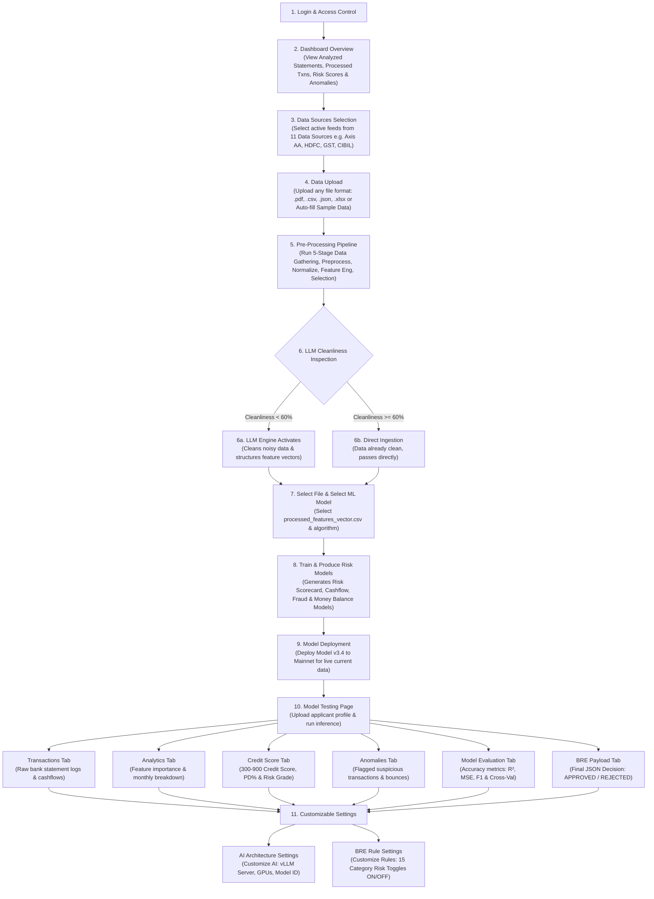

# SFL BRE Portal — System Architecture & Workflow Report

**Organization:** Satin Finserv Limited (SFL)  
**System:** AI-Powered Business Rule Engine (BRE) & Credit Risk Platform  
**Version:** v3.4 Production Stack  

---

## 1. Project Objective & System Overview

The **Satin Finserv Limited (SFL) BRE Portal** is an enterprise-grade automated credit underwriting and risk decisioning platform. It automates loan evaluation by aggregating multi-source financial feeds, cleansing noisy raw data using local LLM engines, executing 5-stage feature engineering, training machine learning risk scorecards, enforcing customizable credit policy rules, and generating instant credit decision payloads.

### Key Capabilities (What the Platform Does):
- **Multi-Feed Ingestion:** Aggregates 11 data vectors (Axis Bank AA, HDFC, SBI, ICICI, GST Returns, CIBIL Bureau, CERSAI, UPI Velocity).
- **Automated LLM Data Cleansing:** Evaluates raw data noise; if cleanliness is below 60% (noise > 40%), the LLM Data Cleaning Engine automatically activates to sanitize fields and engineer features.
- **Machine Learning Risk Modeling:** Trains 4 specialized sub-models (Credit Risk Scorecard, Cashflow Predictor, Fraud Detector, Liquidity Model) using algorithms like Gradient Boosting and Random Forest.
- **Real-Time Underwriting & Risk Scoring:** Calculates 300–900 credit scores, Probability of Default (PD%), risk grades (LOW, MEDIUM, HIGH), and flags suspicious transactions.
- **Customizable BRE Policy Rules:** Allows credit managers to toggle individual risk rules ON/OFF across 15 Underwriting Rule Categories.

---

## 2. End-to-End System Workflow Diagram

---

## 3. Platform Modules Overview

| Module Name | Purpose & Primary Function |
| :--- | :--- |
| **Overview Dashboard** | Provides senior management with live portfolio KPIs, bar charts, donut charts, and bank statement ingestion feeds. |
| **Data Sources** | Enables selecting active financial feeds from 11 data vectors and adding custom feeds. |
| **Model Hub** | Handles raw file upload, pre-processing, LLM cleanliness filtering, ML model training, and version deployment. |
| **Model Testing** | Conducts live applicant risk scoring across 6 tabs (Transactions, Analytics, Credit Score, Anomalies, Model Evaluation, BRE Payload). |
| **AI Architecture** | Configures self-hosted vLLM engine settings (vLLM Endpoint, Model ID, GPU allocation, memory utilization). |
| **Settings** | Configures credit underwriting policies by toggling individual rules ON/OFF across 15 Risk Categories. |
